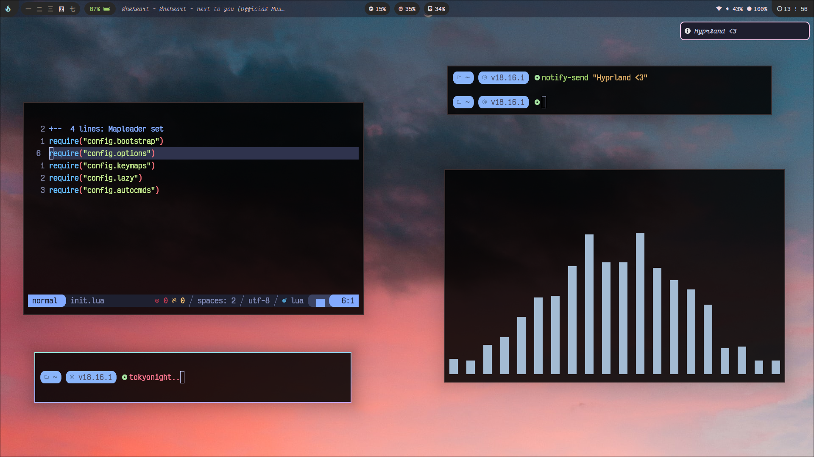
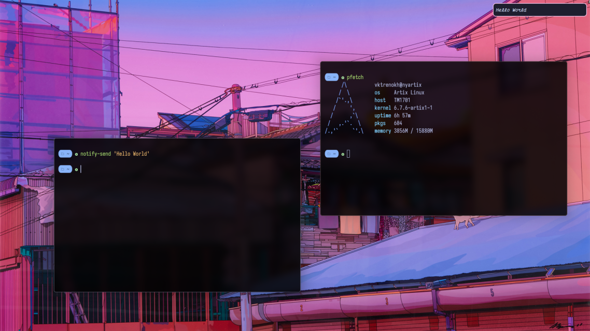
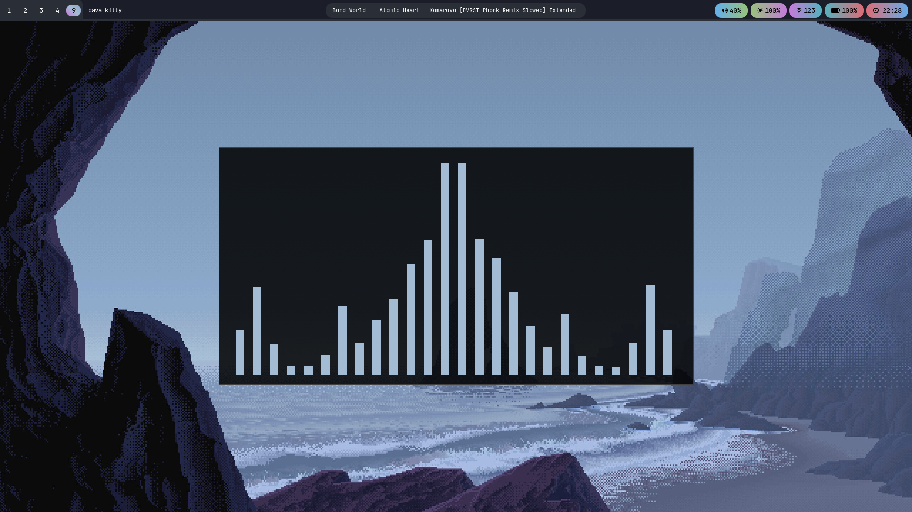
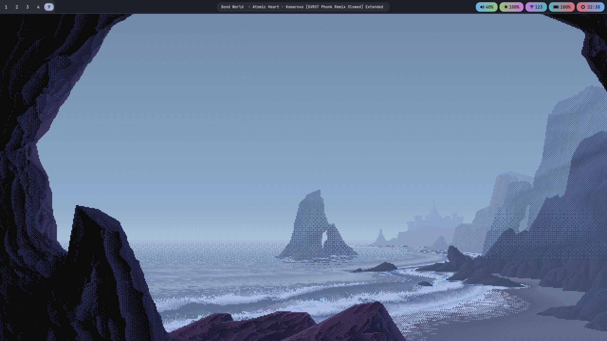
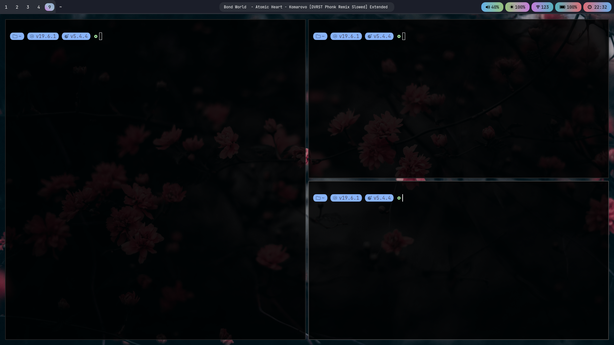
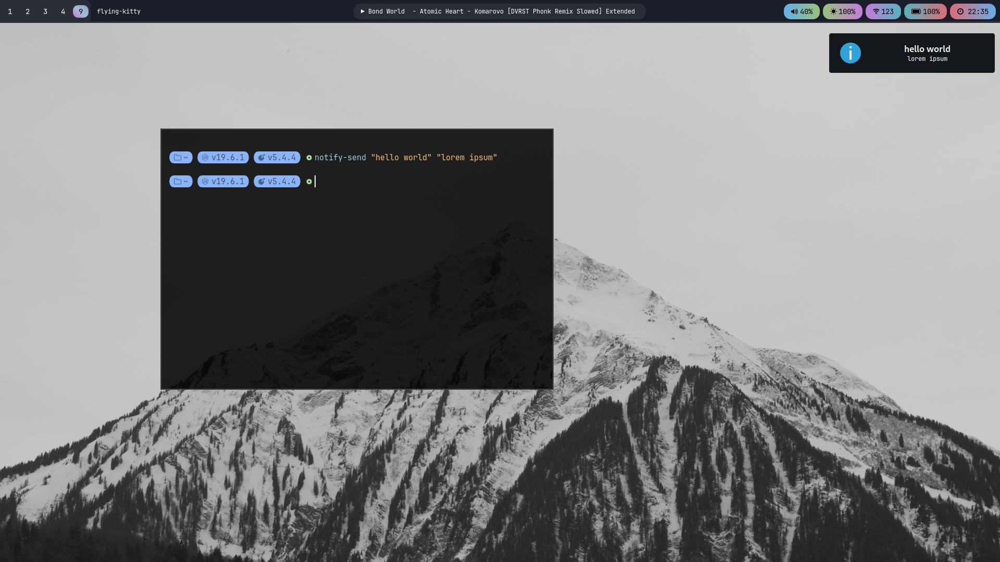
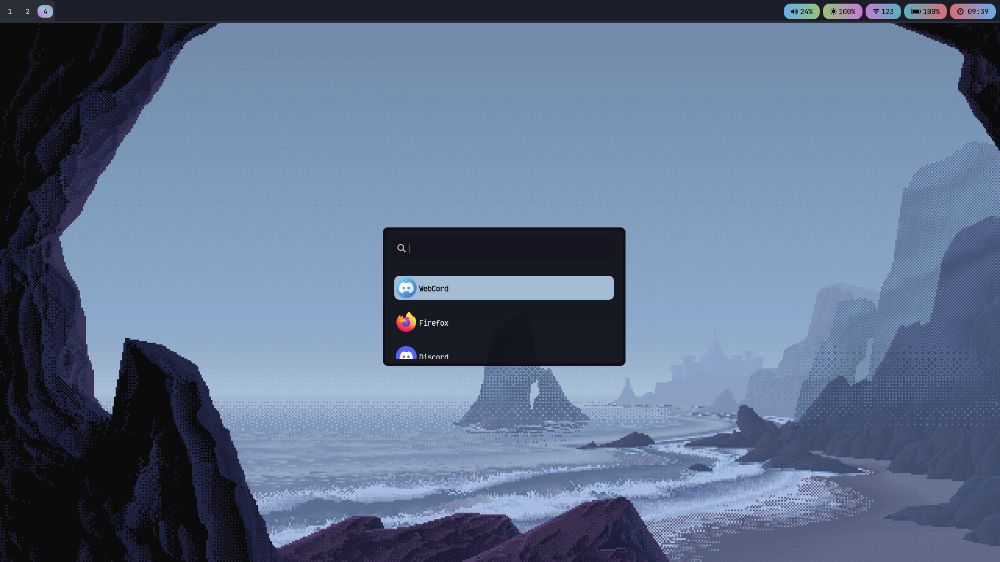

## Hyprland




## Sway (old)







## Artix Optimisations

https://gist.github.com/themagicalmammal/37276c97897d40598e975f5e563252a6

## Packages

Install all needed packages

```bash
sudo pacman -S --needed hyprland neovim helix lua lxappearance artix-dark-theme tmux kitty \
                        pipewire pipewire-pulse wireplumber xdg-desktop-portal-hyprland brightnessctl wpa_supplicant \
                        noto-fonts-cjk noto-fonts-emoji noto-fonts ripgrep fzf zsh hyprpicker rofi
```

Aur Packages

```bash
paru -S gitmux bibata-cursor-theme swww playerctl hyprshade grimblast \
   quickshell-git
```

Qt packages
```bash
sudo pacman -S qt6-base qt6-5compat qt6-positioning qt6-svg qt6-imageformats qt6-multimedia
```

Starship

```bash
curl -sS https://starship.rs/install.sh | sh
```

Eza

```bash
git clone https://github.com/eza-community/eza.git
cd eza
cargo install --path .
```

## Fonts

- Victor Mono NFM
- Iosevka Mono NFM

## Bootloader Theme

https://github.com/catppuccin/grub

## Firmware

- [qmk](https://github.com/vktrenokh/qmk_firmware)
